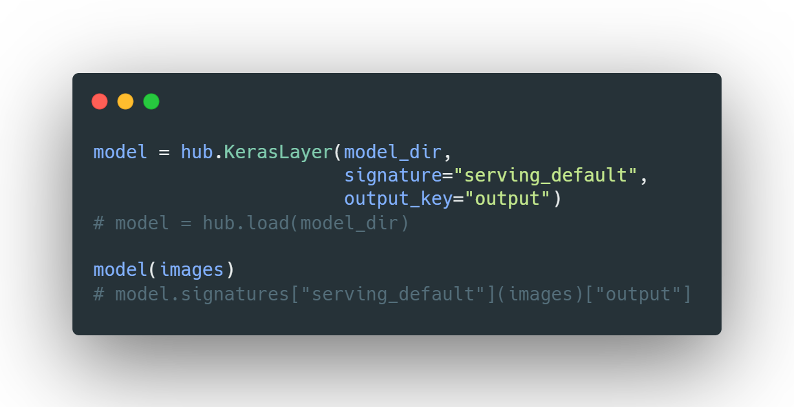
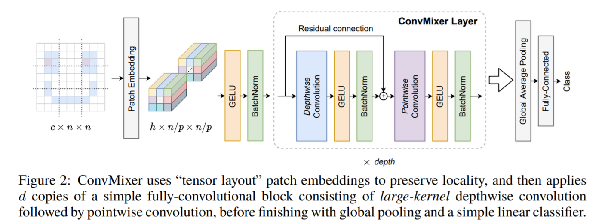

# ConvMixer-torch2tf [](https://twitter.com/intent/tweet?text=Wow:&url=https%3A%2F%2Fgithub.com%2FRishit-dagli%2FConvMixer-torch2tf)

[](https://colab.research.google.com/github/Rishit-dagli/ConvMixer-torch2tf/blob/main/classification.ipynb)


[](https://github.com/Rishit-dagli/ConvMixer-torch2tf/stargazers)
[](https://github.com/Rishit-dagli)
[](https://twitter.com/intent/follow?screen_name=rishit_dagli)



This repository hosts code for converting the original ConvMixer [^1] (PyTorch) models to TensorFlow. In this repo we convert these 3 ConvMixer models to TensorFlow SavedModels:

| Model Name | resolution | acc@1 | #params | File Size | TensorFlow Model |
|------------|:---:|:---:|:---:|----------:|:--------------:|
| ConvMixer-1536/20 | 224x224 | 81.37 | 51.6 x 10^6 | 184MB | [github](https://github.com/Rishit-dagli/ConvMixer-torch2tf/releases/download/untagged-de81892a1b06347b8d97/convmixer_1536_20.tar.gz)/[drive](https://drive.google.com/file/d/1qrzap4vi2KFQTHxf9h_AMbWGvtbP5rIA/view?usp=sharing)/[bucket](https://storage.googleapis.com/convmixer-hubmodels.appspot.com/convmixer_1536_20.tar.gz) |
| ConvMixer-768/32 | 224x224 | 80.16 | 21.1 x 10^6 | 75MB | [github](https://github.com/Rishit-dagli/ConvMixer-torch2tf/releases/download/untagged-de81892a1b06347b8d97/convmixer_768_32.tar.gz)/[drive](https://drive.google.com/file/d/1NJgHKjPd3YC8XHypQIs5A05XKd15o0s3/view?usp=sharing)/[bucket](https://storage.googleapis.com/convmixer-hubmodels.appspot.com/convmixer_768_32.tar.gz) |
| ConvMixer-1024/20 | 224x224 | 76.94 | 24.4 x 10^6 | 87MB | [github](https://github.com/Rishit-dagli/ConvMixer-torch2tf/releases/download/untagged-de81892a1b06347b8d97/convmixer_1024_20.tar.gz)/[drive](https://drive.google.com/file/d/1--jRgK0KmLtWCJswYtfxSIfEcjAOrJyv/view?usp=sharing)/[bucket](https://storage.googleapis.com/convmixer-hubmodels.appspot.com/convmixer_1024_20.tar.gz) |

ConvMixer is a simple model, proposed in the paper "Patches Are All You Need?" [^2] for image classification pre-trained on ImageNet-1K. ConvMixer uses only standard convolutions to achieve the mixing steps. Despite it's simplicity it outperforms ViT and MLP-Mixer. Using the [`conversion.ipynb`](conversion.ipynb) notebook, one should be able to take a model from the pre-trained models and convert that to TensorFlow and use that with TensorFlow Hub and Keras.



The original model classes and weights were converted using the `onnx-tf` tool [^3].

## About the Notebooks

### [`conversion.ipynb`](conversion.ipynb)
[](https://colab.research.google.com/github/Rishit-dagli/ConvMixer-torch2tf/blob/main/conversion.ipynb)
[](https://mybinder.org/v2/gh/Rishit-dagli/ConvMixer-torch2tf/HEAD?labpath=conversion.ipynb)

This notebook demonstrates how the models were converted to TensorFlow SavedModel and uses `onnx-tf` [^3] tool to do so. This notebook loads the ConvMixer model using timm (PyTorch Image Models) [^4] modifying some of the code to allow doing so as shown in the [`timm_convmixer.py`](timm_convmixer.py) file in this repo.

### [`classification.ipynb`](classification.ipynb)
[](https://colab.research.google.com/github/Rishit-dagli/ConvMixer-torch2tf/blob/main/classification.ipynb)
[](https://mybinder.org/v2/gh/Rishit-dagli/ConvMixer-torch2tf/HEAD?labpath=classification.ipynb)

This noteboook demonstrates how to load a ConvMixer Model varaint and run image classification using TensorFlow and TensorFlow Hub [^5]. This notebook will soon be updated to fetch models from tfhub.dev. These models can be used in the exact same manner with TensorFlow Keras too.

## Want to Contribute 🙋‍♂️?

Awesome! If you want to contribute to this project, you're always welcome! See [Contributing Guidelines](CONTRIBUTING.md). You can also take a look at [open issues](https://github.com/Rishit-dagli/ConvMixer-torch2tf/issues) for getting more information about current or upcoming tasks.

## Want to discuss? 💬

Have any questions, doubts or want to present your opinions, views? You're always welcome. You can [start discussions](https://github.com/Rishit-dagli/ConvMixer-torch2tf/discussions).

## License

```
Copyright 2020 Rishit Dagli

Licensed under the Apache License, Version 2.0 (the "License");
you may not use this file except in compliance with the License.
You may obtain a copy of the License at

    http://www.apache.org/licenses/LICENSE-2.0

Unless required by applicable law or agreed to in writing, software
distributed under the License is distributed on an "AS IS" BASIS,
WITHOUT WARRANTIES OR CONDITIONS OF ANY KIND, either express or implied.
See the License for the specific language governing permissions and
limitations under the License.
```

## References

[^1]: Official Code Implementation: https://github.com/tmp-iclr/convmixer
[^2]: Anonymous. Patches Are All You Need? 2021. openreview.net, https://openreview.net/forum?id=TVHS5Y4dNvM.
[^3]: onnx-tensorflow. Tensorflow Backend for ONNX. https://github.com/onnx/onnx-tensorflow
[^4]: Ross Wightman, . "PyTorch Image Models." https://github.com/rwightman/pytorch-image-models. (2019).
[^5]: TensorFlow Hub. https://www.tensorflow.org/hub
